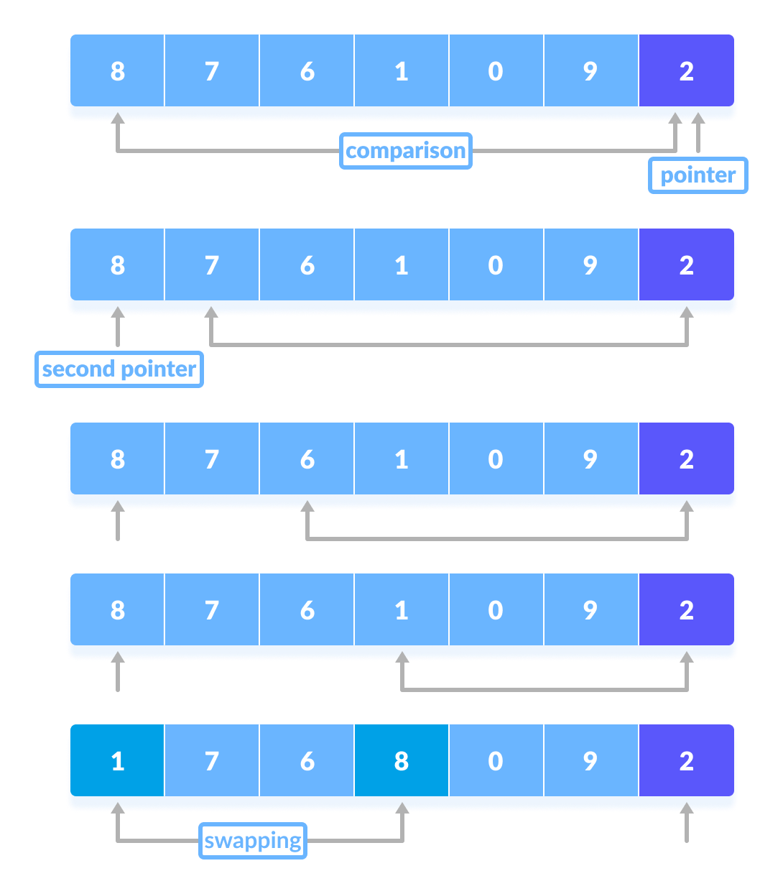
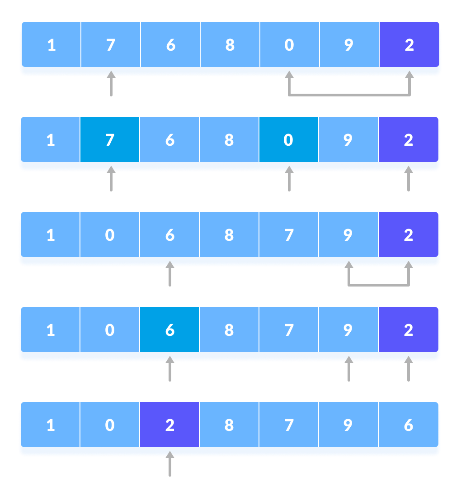
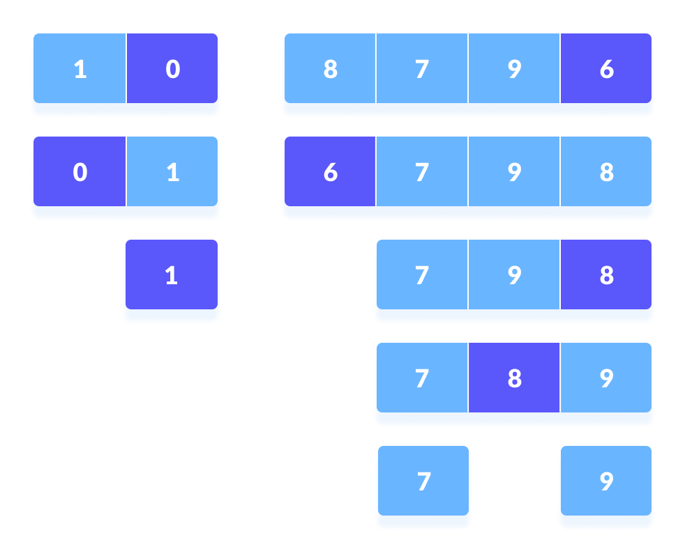
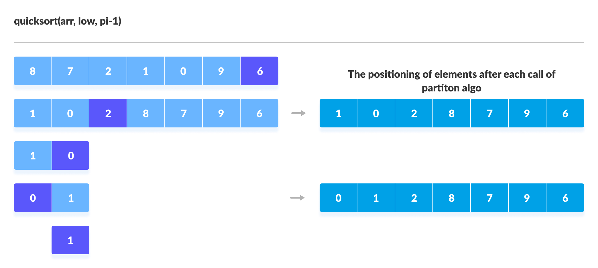

# Quick Sort Algorithm
## Introduction

<p> Quick sort is considered as the most efficient algorithm and it is based on <b>Divide and Conquer Approach</b>. <br></p>

## Algorithm 
<p><i><b>Pivot element</b> can be any element from the array, it can be the first element, the last element or any random element. In this tutorial, we will take the rightmost element or the last element as pivot.</i>


<hr>


 
1.  A pivot element is chosen from the array. You can choose any      element from the array as the pviot element.Here, we have         taken the rightmost (ie. the last element) of the array as        the pivot element.
<p align=center></p>

2. The elements smaller than the pivot element are put on the left and the elements greater than the pivot element are put on the right.
<p align=center></p>

The above arrangement is achieved by the following steps.
 *  pointer is fixed at the pivot element. The pivot element is compared with the elements beginning from the first index. If the element greater than the pivot element is reached, a second pointer is set for that element.  
 * Now, the pivot element is compared with the other elements. If element smaller than the pivot element is reached, the smaller element is swapped with the greater element found earlier.
    <p align=center></p>

* The process goes on until the second last element is reached.
 
* Finally, the pivot element is swapped with the second pointer.
     <p align=center></p>

3. Pivot elements are again chosen for the left and the right sub-parts separately. Within these sub-parts, the pivot elements are placed at their right position. Then, step 2 is repeated.
    <p align=center></p>

4. The sub-parts are again divided into smallest sub-parts until each subpart is formed of a single element.
5. At this point, the array is already sorted.
<br>
<b>Quicksort uses recursion for sorting the sub-parts.</b>
On the basis of Divide and conquer approach, quicksort algorithm can be explained as:

 <b> Divide</b><br>
The array is divided into subparts taking pivot as the partitioning point. The elements smaller than the pivot are placed to the left of the pivot and the elements greater than the pivot are placed to the right.

 <b>Conquer</b><br>
The left and the right subparts are again partitioned using the by selecting pivot elements for them. This can be achieved by recursively passing the subparts into the algorithm.

 <b>Combine</b><br>
This step does not play a significant role in quicksort. The array is already sorted at the end of the conquer step.
<p align=center></p>
<br>
<p align=center></p>


## Time Complexity
* <b>Worst Case Complexity</b> <code>O(n<sup>2</sup>)</code>
It occurs when the pivot element picked is always either the greatest or the smallest element.
In the above algorithm, if the array is in descending order, the partition algorithm always picks the smallest element as a pivot element.<br><br>
* <b>Best Case Complexity</b><code>O(n*logn)</code>
It occurs when the pivot element is always the middle element or near to the middle element.<br><br>
* <b>Average Case Complexity</b><code>O(n*logn)</code>
It occurs when the above conditions do not occur.<br>
 


| Worst Case TC | Average Case TC | Best Case TC |
| ---------- | ------------ | --------- |
| O(n<sup>2</sup>)      | O(nlogn)     | O(nlogn)  |
## Implementation
Python
```
def partition(arr,low,high): 
    i = ( low-1 )         # index of smaller element 
    pivot = arr[high]     # pivot 
  
    for j in range(low , high): # if current element is smaller than pivot 
        if   arr[j] <= pivot:  
            i = i+1 
            arr[i],arr[j] = arr[j],arr[i] 
  
    arr[i+1],arr[high] = arr[high],arr[i+1] 
    return ( i+1 ) 
  

  
# Function to do Quick sort 
def quickSort(arr,low,high): 
    if low < high: 
         pi = partition(arr,low,high) 
         quickSort(arr, low, pi-1) 
         quickSort(arr, pi+1, high) 
```         
